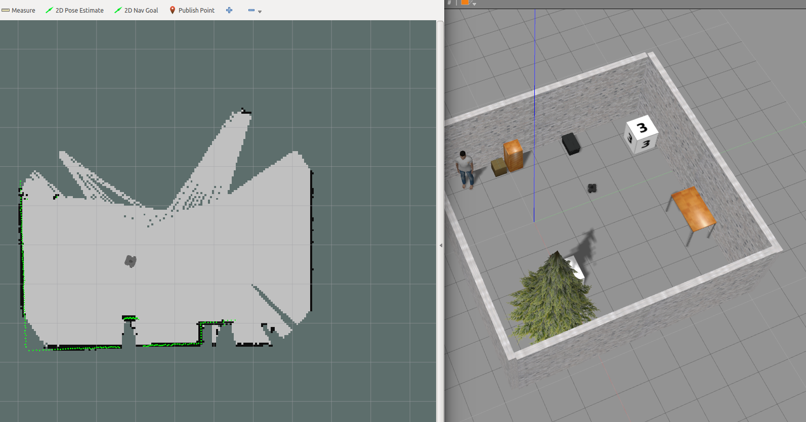

# Frontier Exploration With Turtlebot
[](https://opensource.org/licenses/MIT) [](https://travis-ci.org/saimouli/frontier_exploration_turtlebot) [](https://coveralls.io/github/saimouli/frontier_exploration_turtlebot?branch=master)

Table Contents:
- [Authors](#authors)
- [Overview](#overview)
- [Licence](#licence)
- [Product Backlog and Sprint Schedule](#sip_process)
- [Presentation](#present)
- [Dependencies](#dependencies)
- [Algorithm Overview](#algorithm)
- [Results](#results)
- [Dependencies Installation](#installdepend)
- [Package Installation](#pacakgeinstallimplement)
- [Run Tests](#tests)
- [Running Demo](#demo)
- [ROSBAG](#rosbag)
- [Doxygen Documentation](#doc)
- [Coverage](#coverage)

# <a name="authors"></a> Authors
- Saurav Kumar
- Saimouli Katragadda

## Saurav
Saurav is pursuing Masters in Robotics Engineering.He has five years of experience in research and development field in automobile sector at Daimler.He is passionate about autonomous driving system such as self steering, cross track error minimization, and traffic detection. Refer to his Linkedin profile [here](https://www.linkedin.com/in/saurav-kumar-2a532242/).

## Saimouli
Saimouli is pursuing Robotic Engineering at UMD. He is passionate about flying cars, drones, and deep learning. In future, he would like design and create autonomous flights. Outside of academics, he is involved with the Autonomous Micro Aerial Vehicle Team and also loves to watch movies and make short films in his free time.

# <a name="overview"></a> Overview

A map of the environment plays a crucial role in our robot’s navigation, guidance and path planning module. With the changing interiors in a room and each time letting the user map
manually is tedious. Having the robot to explore the entire room autonomously to build a map is very
essential for a product to be commercially successful. The objective of this project is to build a basic
turtlebot based frontier exploration package capable of autonomously navigating and building a map in a confined
room until the user is satisfied with the output using ROS and C++.

This repository is created as the part of ENPM808x Final Project to build an autonomous mobile robot for ACME Robotics, which navigates through an unexplored area and builds the map using simulated turtlebot platform. The software implements autonomous navigation and mapping capability using ROS nodes and services and the simulated turtlebot platform.

# <a name="licence"></a> License
```
MIT License

Copyright (c) 2018 Saimouli Katragadda, Saurav Kumar

Permission is hereby granted, free of charge, to any person obtaining a copy
of this software and associated documentation files (the "Software"), to deal
in the Software without restriction, including without limitation the rights
to use, copy, modify, merge, publish, distribute, sublicense, and/or sell
copies of the Software, and to permit persons to whom the Software is
furnished to do so, subject to the following conditions:

The above copyright notice and this permission notice shall be included in all
copies or substantial portions of the Software.

THE SOFTWARE IS PROVIDED "AS IS", WITHOUT WARRANTY OF ANY KIND, EXPRESS OR
IMPLIED, INCLUDING BUT NOT LIMITED TO THE WARRANTIES OF MERCHANTABILITY,
FITNESS FOR A PARTICULAR PURPOSE AND NONINFRINGEMENT. IN NO EVENT SHALL THE
AUTHORS OR COPYRIGHT HOLDERS BE LIABLE FOR ANY CLAIM, DAMAGES OR OTHER
LIABILITY, WHETHER IN AN ACTION OF CONTRACT, TORT OR OTHERWISE, ARISING FROM,
OUT OF OR IN CONNECTION WITH THE SOFTWARE OR THE USE OR OTHER DEALINGS IN THE
SOFTWARE.
```

# <a name="sip_process"></a> Product Backlog and Sprint Schedule
The product backlog can be accessed [here](https://docs.google.com/spreadsheets/d/1aUEmwQJSr9hcHAbKPmq_1oXtsOK8NiAJHHwCcbalw80/edit#gid=0) to access the sprint schedule

The Sprint Planning and review can be accessed [here](https://docs.google.com/document/d/19h8M4_cV-hC2vH-sakYy-WoBOPhtShtMgyjMKj_OG6o/edit?usp=sharing)

Saimouli Katragadda and Saurav Kumar worked together on this implementation and alternate commits were made. The commits are made by the driver while the other person acted as navigator.

# <a name="present"></a> Presentation
Link to the video can be found [here](https://youtu.be/45f4QF6Crtc)


Link to the sildes can be found [here](https://docs.google.com/presentation/d/1LBri_mfvDsKqvUMGZ5PVOpgEUb53M30awwxja8da1Mo/edit?usp=sharing)

[Dependencies Installation steps](https://youtu.be/P_-cCO_jp-s)

# <a name="dependencies"></a> Dependencies
This project uses the following packages:
1. ROS Kinetic
2. Ubuntu 16.04
3. Packages Dependencies:

 * Turtlebot3 ROS packages
 * gmapping slam packages
 * roscpp
 * rospy
 * std_msgs
 * geometry_msgs
 * tf
 * rostest
 * rosbag
 * sensor_msgs
 * move_base_msgs


# <a name="algorithm"></a> Algorithm Overview
There are two path planning generators called   ```Linear Path Generator``` and ```Spiral Path Generator``` to generate the motion of the turtlebot in the simulated obstacle free environment. The ```Linear Path Generator``` generates a linear path for the turtlebot in the collision free area. Whereas, the later generates discrete spiral path. ```CollisionDetecter``` overrides ```Linear Path Generator``` and ```Spiral Path Generator``` whenever an object is in the vicinity of the turtlebot.


The ```CollisionDetecter``` algorithm divides the vicinity of the turtelbot into two areas : ```Front``` & ```Rear```. It then compares the obstacles in these two vicinities and make a decision either to move forward or to rotate. 

The ```Linear Path Generator``` or ```Spiral Path Generator``` kicks in back once both of the vicinities are obstacle free.

# <a name="results"></a> Results
<p align="center">
<a target="_blank">
</a>
</p>

# <a name="installdepend"></a> Dependencies Installation
[A video is created demonstrating the below installation steps](https://youtu.be/P_-cCO_jp-s)

- ## Turtlebot3 packages installation
Following section will describe steps necessary to install turtlebot3 dependencies. Alternately you can follow from the
offical guide [here](http://emanual.robotis.com/docs/en/platform/turtlebot3/setup/#setup)

  Install ROS turtlebot3 dependent packages:

  ```sudo apt-get install ros-kinetic-joy ros-kinetic-teleop-twist-joy ros-kinetic-teleop-twist-keyboard ros-kinetic-laser-proc ros-kinetic-rgbd-launch ros-kinetic-depthimage-to-laserscan ros-kinetic-rosserial-arduino ros-kinetic-rosserial-python ros-kinetic-rosserial-server ros-kinetic-rosserial-client ros-kinetic-rosserial-msgs ros-kinetic-amcl ros-kinetic-map-server ros-kinetic-move-base ros-kinetic-urdf ros-kinetic-xacro ros-kinetic-compressed-image-transport ros-kinetic-rqt-image-view ros-kinetic-gmapping ros-kinetic-navigation ros-kinetic-interactive-markers ros-kinetic-hector-mapping```

  For Turtlebot3 packages follow the following steps:
  ```
mkdir -p ~/catkin_ws/src
cd ~/catkin_ws/
catkin_make
source devel/setup.bash
cd src/
git clone https://github.com/ROBOTIS-GIT/turtlebot3_msgs.git
git clone https://github.com/ROBOTIS-GIT/turtlebot3.git
git clone https://github.com/ROBOTIS-GIT/turtlebot3_simulations.git
cd ..
catkin_make
```


- ## Sourcing
Open your bashrc file
```
gedit ~/.bashrc
```
Type the following in your bashrc file:

  Replace ```<IP>``` with your systems IP address
```
source /opt/ros/kinetic/setup.bash
source ~/catkin_ws/devel/setup.bash
export ROS_MASTER_URI=http://<IP>:11311
export ROS_HOSTNAME=<IP>
export TURTLEBOT3_MODEL=waffle
 ```
save and close the bashrc file and source it
```source ~/.bashrc```

#  <a name="pacakgeinstallimplement"></a> Package Installation


## Build Instructions
[A demo video is prepared to show build and run steps](https://youtu.be/Joi58ArrooQ)

If you followed above package dependencies installation section follow this else see the ```version2```
```
cd ~/catkin_ws/src/
git clone --recursive https://github.com/saimouli/frontier_exploration_turtlebot.git
cd ..
catkin_make
```
## Version2
To build follow the following commands
```
mkdir -p ~/catkin_ws/src
cd ~/catkin_ws/
catkin_make
source devel/setup.bash
cd src/
git clone --recursive https://github.com/saimouli/frontier_exploration_turtlebot.git
cd ..
catkin_make
```

# <a name="tests"></a>Running Tests
- Level 1: unit tests
- Level 2: integration testsoth can run by the following command:
```
cd ~/catkin_ws/
catkin_make run_tests frontierExplorer
```

# <a name="demo"></a> Running Demo
- Demo can be run by following the undermentioned instructions
```
cd ~/catkin_ws
roslaunch frontier_explorer_turtlebot demo.launch
```
On the terminal there will be set of instructions which required user input
```
Would you like to take linear path (0) or spiral path finer(1)? (Enter 0 or 1)
```
Based on the input the turtlebot will execute its exploration. Default is set to linear path. More about the spiral and linear search pattern is explained in the algorithm section.

  If you are satisfied with the map it produced press ctr+c on the terminal where you have given your input

  In a seperate terminal run
```
rosrun map_server map_saver -f my_map
```

# <a name="rosbag"></a> ROSBAG

## Recording ROSBAG

 Record the rostopics using the following command with the launch file:
```
roslaunch frontier_explorer_turtlebot demo.launch record:=true
```
recorded bag file will be stored in the results folder and records all except camera topics

  To record for a specific time
```
roslaunch frontier_explorer_turtlebot demo.launch record:=true secs:=20
```
In the above case rosbag will record for 20 seconds

## Running ROSBAG
Navigate to the results folder
```
cd ~/catkin_ws/src/frontier_explorer_turtlebot/results
```
play the bag file
```
rosbag play turtlebotRecord.bag
```
## Inspecting ROSBAG
```rqt_bag``` is a GUI tool to inspect,view and publish the bag files.
Navigate to the results folder
```
cd ~/catkin_ws/src/frontier_explorer_turtlebot/results
```
play the bag file
```
rqt_bag turtlebotRecord.bag
```

# <a name="doc"></a>
# Doxygen Documentation
- If you'd still like to generate it then follow the instructions below
```
sudo apt-get install doxygen
sudo apt-get install doxywizard
doxywizard
```
When doxywizard is open, select the workspace as the repository. Fill in the details as required and set the source code folder to the repository as well. Create a new folder in the repository and select that as the destination directory. Proceed with the default settings and generate the documentation.

- Alternate way to generate and view doxygen document is as follows:
```
cd ~/catkin_ws/src/frontier_explorer_turtlebot/docs
doxygen explorerdoxy.doxyfile
cd html
firefox index.html
```
Refer to doxygen document :
[Doxygen Document](http://htmlpreview.github.io/?https://github.com/saimouli/frontier_exploration_turtlebot/blob/master/docs/html/index.html)


# <a name="coverage"></a> Coverage
- The current code coverage for the project is 92.0%.
```
cd ~/catkin_ws/build
lcov --directory . --capture --output-file coverage.info
lcov --list coverage.info
```
This will output the coverage of each file in the terminal. To create an html file for the same, run the following command.
```
genhtml coverage.info --output-directory covout
```
This will store the ```index.html``` file in the folder ```covout```
# <a name="issue"></a>
# Known Issues
Navigation: Sometimes when launching the turtlbot3 simulation might get stuck. In that case please relaunch the simulation using the launch file 

While building the slam authors assumed the environment is filled with obstacles. If there is an empty room the built slam map will not be a good estimate. 

If the user chooses a spiral trajectory generator, the map will build sooner but might also distort because of too many rotations involved. The 2d slam methods are bad as they drift a lot. In the next version, authors are trying to integrate RGBD slam. 

<!--stackedit_data:
eyJoaXN0b3J5IjpbLTcwMTQ4NTc3NCwtMTY0MzUyMTc2MSwtMj
k5NjIxNDM4LDE2Mjg2MTE3MTRdfQ==
-->
